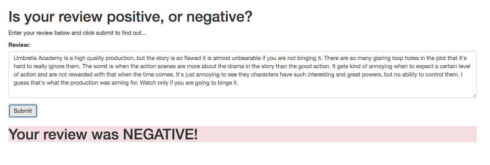

# Project 1: Sentiment Analysis with Neural Network
> *This project is part of a series worked on as a part of my Udacity Nanodegree program. The files uploaded when the repository was created is the code provided. All the commits and pull requests are done by me.*

> **Machine Learning Engineer Nanodegree at Udacity** *sponsored by AWS*

## Example of a correctly classified test review
Steps taken to get from raw data to a web app:
1. IMDB data is processed. Reviews cleaned and Bag of Words text processing carried out.
2. A Recurrent Neural Network is trained on the processed data.
3. An endpoint (API) is created using the trained model in Amazon SageMaker.
4. A Lambda Function is created using Amazon Web Services to process raw data (reviews) before it is passed on to the model to make predictions.
5. An REST API is created to send/recieve data to/from the Lambda Function from/to the web app.
**Diagram to show how it all works**

> When all is running, the web app is run on a local host and the following is observed.

